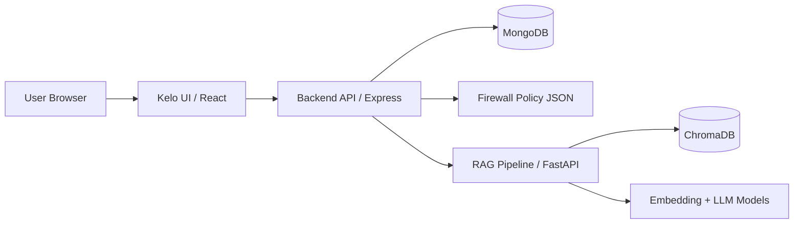

# Technical-Support-RAG

Enterprise-ready Technical Support assistant platform with:

- A TypeScript/Express backend API with RBAC, audit logs, organization/user management, and firewall controls
- A React + Vite frontend (Kelo UI) for authentication, chat, dashboard, and admin workflows
- A Python FastAPI RAG pipeline using ChromaDB + SentenceTransformers + TinyLlama

This repository is organized as a multi-service workspace so each part can be developed independently and run together locally.

## Table of Contents

1. [Project Overview](#project-overview)
2. [Repository Structure](#repository-structure)
3. [Architecture](#architecture)
4. [Prerequisites](#prerequisites)
5. [Clone and Install](#clone-and-install)
6. [Environment Configuration](#environment-configuration)
7. [Run the Full Stack Locally](#run-the-full-stack-locally)
8. [Backend Guide](#backend-guide)
9. [Frontend Guide](#frontend-guide)
10. [Pipeline Guide (RAG Service)](#pipeline-guide-rag-service)
11. [Kelo UI Guide](#kelo-ui-guide)
12. [API Route Map](#api-route-map)
13. [Troubleshooting](#troubleshooting)
14. [Production Notes](#production-notes)

## Project Overview

The platform supports secure internal technical-support conversations with role-based access, organization-level data isolation, and optional firewall policies.

At runtime:

1. The user interacts with the Kelo UI frontend.
2. The frontend calls the backend API for auth, users, chats, documents, and firewall operations.
3. For AI answers, the backend forwards chat questions to the Python RAG service.
4. The RAG service retrieves relevant context from ChromaDB and generates a response.

## Repository Structure

```text
.
├─ backend/        # Express + TypeScript API layer
├─ kelo_ui/        # React + Vite frontend application
├─ pipeline/       # FastAPI RAG inference and retrieval pipeline
├─ firewall/       # Persistent firewall policy file used by backend
└─ README.md
```

## Architecture



## Prerequisites

Install these before setup:

- Node.js 18+
- npm 9+
- Python 3.10+
- MongoDB 6+
- Git

Recommended:

- 8 GB+ RAM (model loading in pipeline can be memory-intensive)
- Internet access for first-time model downloads in the pipeline

## Clone and Install

```bash
git clone https://github.com/AMOHAMMEDIMRAN/Technical-Support-RAG.git
cd Technical-Support-RAG
```

Install dependencies per service:

```bash
# Backend
cd backend
npm install

# Frontend (Kelo UI)
cd ../kelo_ui
npm install

# Pipeline
cd ../pipeline
python -m venv .venv
# Windows PowerShell
.venv\Scripts\Activate.ps1
# macOS/Linux
# source .venv/bin/activate
pip install -r requirements.txt
```

## Environment Configuration

### 1) Backend

Copy and edit:

```bash
cd backend
copy .env.example .env
```

Important values in `backend/.env`:

- `PORT=5000`
- `MONGODB_URI=mongodb://localhost:27017/tech-support-assistant`
- `JWT_SECRET=...`
- `ADMIN_EMAIL=admin123@gmail.com`
- `ADMIN_PASSWORD=admin123`
- `AI_ENGINE_URL=http://localhost:8000`
- `ALLOWED_ORIGINS=http://localhost:5173,http://localhost:7878`

### 2) Frontend (Kelo UI)

Copy and edit:

```bash
cd kelo_ui
copy .env.example .env
```

Required values in `kelo_ui/.env`:

- `VITE_API_BASE_URL=http://localhost:5000/api`
- `VITE_RAG_API_BASE_URL=http://127.0.0.1:8000`

### 3) Pipeline

No required env file by default. Current defaults in code:

- API host/port: `127.0.0.1:8000`
- Vector DB path: `pipeline/data/chroma`
- Input CSV: `pipeline/data/Project.csv`

## Run the Full Stack Locally

Use 3 terminals.

### Terminal 1: Pipeline

```bash
cd pipeline
# Activate venv if needed
.venv\Scripts\Activate.ps1
uvicorn main:app --host 127.0.0.1 --port 8000 --reload
```

Health check: `http://127.0.0.1:8000/`

### Terminal 2: Backend

```bash
cd backend
npm run dev
```

Health check: `http://localhost:5000/api/health`

### Terminal 3: Frontend (Kelo UI)

```bash
cd kelo_ui
npm run dev
```

App URL: `http://localhost:7878`

## Backend Guide

Path: `backend/`

### Purpose

Provides:

- Authentication and JWT-based authorization
- Organization and user management
- Chat storage and message handling
- Document metadata and download APIs
- Audit log tracking
- Configurable firewall controls persisted in `firewall/config.json`

### Runtime Behavior

- Connects to MongoDB on startup
- Seeds a super-admin user if not already present
- Enforces CORS, security headers, and rate limiting
- Calls RAG service `/ask` endpoint for assistant replies

### Useful Commands

```bash
cd backend
npm run dev      # development
npm run build    # compile TypeScript to dist/
npm run start    # run compiled build
npm run lint
npm run format
npm run seed     # manual admin seed
```

### First Login

Default admin credentials come from `backend/.env`:

- Email: `ADMIN_EMAIL`
- Password: `ADMIN_PASSWORD`

Change these immediately after first login.

### Notes

- Document upload route expects multipart middleware; current route file includes a TODO comment to add multer middleware in route wiring.
- Firewall bypass paths default to `/api/health` and `/api/auth/login`.

## Frontend Guide

Path: `kelo_ui/`

### Purpose

Provides:

- Public home/login experience
- Protected chat experience
- Role-aware dashboard for CEO and SUPER_ADMIN users
- Admin sections for users, organization, settings, and firewall

### Stack

- React 19 + TypeScript
- Vite
- TanStack Router
- Tailwind CSS v4
- Zustand for auth state

### Useful Commands

```bash
cd kelo_ui
npm run dev
npm run build
npm run preview
npm run lint
```

### Routing Snapshot

- `/` -> Home/Login
- `/chat` -> Chat panel (requires authentication)
- `/dashboard/*` -> Admin dashboard (requires CEO/SUPER_ADMIN role)

## Pipeline Guide (RAG Service)

Path: `pipeline/`

### Purpose

Hosts the retrieval + generation endpoint used by backend chat flow.

### What It Does

1. Loads `data/Project.csv` on startup (currently first 5 rows for lightweight local indexing)
2. Embeds rows using `BAAI/bge-small-en-v1.5`
3. Stores vectors in persistent ChromaDB at `data/chroma`
4. Accepts POST `/ask` with `{ "question": "..." }`
5. Generates an answer using `TinyLlama/TinyLlama-1.1B-Chat-v1.0`

### Run Commands

```bash
cd pipeline
python -m venv .venv
.venv\Scripts\Activate.ps1
pip install -r requirements.txt
uvicorn main:app --host 127.0.0.1 --port 8000 --reload
```

### API Endpoints

- `GET /` -> service health
- `POST /ask` -> RAG answer generation

### Pipeline Data Refresh

Replace or update `pipeline/data/Project.csv` then restart the service to reload and re-index at startup.

## Kelo UI Guide

Path: `kelo_ui/`

This section focuses on project conventions for contributors working specifically on the UI codebase.

### Key Folder Layout

```text
kelo_ui/src/
├─ core/             # domain types and core abstractions
├─ infrastructure/   # API clients and integration config
├─ presentation/     # UI views/components/layouts/theme
├─ routes/           # route definitions
└─ hooks/            # shared hooks
```

### UI Development Workflow

1. Add or update domain types in `src/core/domain/types.ts` if needed.
2. Implement data calls in `src/infrastructure/api/*`.
3. Build UI in `src/presentation/*`.
4. Register route in `src/routes/*`.
5. Verify role guards for protected routes.

### API Configuration Source of Truth

Use `src/infrastructure/config/api.config.ts` for base URLs and endpoint constants.

## API Route Map

Base URL: `http://localhost:5000/api`

- `GET /health`
- `POST /auth/login`
- `GET /auth/profile`
- `PUT /auth/profile`
- `POST /auth/change-password`
- `POST /auth/logout`
- `GET/POST /organizations`
- `GET /organizations/my-organization`
- `GET/PUT/DELETE /organizations/:id`
- `GET/POST /users`
- `GET/PUT/DELETE /users/:id`
- `PATCH /users/:id/toggle-status`
- `GET/POST /chats`
- `GET/PUT/DELETE /chats/:id`
- `POST /chats/:id/messages`
- `PATCH /chats/:id/archive`
- `GET/POST /documents`
- `GET/PUT/DELETE /documents/:id`
- `GET /documents/:id/download`
- `GET /audit-logs/my-logs`
- `GET /audit-logs/stats`
- `GET /audit-logs`
- `GET /audit-logs/:id`
- `GET /firewall/config`
- `PUT /firewall/config`
- `GET /firewall/stats`
- `GET /firewall/users`
- `POST /firewall/blocked-ips`
- `DELETE /firewall/blocked-ips/:ip`
- `POST /firewall/blocked-users`
- `DELETE /firewall/blocked-users/:userId`

## Troubleshooting

### Backend cannot connect to MongoDB

- Ensure MongoDB is running.
- Verify `MONGODB_URI` in `backend/.env`.

### Frontend cannot call backend

- Verify backend is running on `http://localhost:5000`.
- Check `VITE_API_BASE_URL` in `kelo_ui/.env`.
- Ensure backend `ALLOWED_ORIGINS` includes frontend URL.

### Chat replies fallback to error message

- Ensure pipeline is running at `http://127.0.0.1:8000`.
- Verify backend `AI_ENGINE_URL` or `RAG_API_BASE_URL` mapping.

### Pipeline startup is slow

- First run downloads embedding/generation models.
- Keep internet access enabled on first startup.

### Firewall blocking expected requests

- Check and update `firewall/config.json` via firewall API endpoints.
- Ensure bypass paths include health/login paths as needed.

## Production Notes

- Replace all default secrets and admin credentials.
- Restrict CORS origins to trusted domains.
- Use HTTPS and secure reverse proxy.
- Add proper file upload middleware and storage handling for document routes.
- Consider external vector DB/model serving for scale.
- Add CI checks for lint/build/test in each service.

---

If you want, I can also generate:

- A Docker Compose file to run all three services together
- Swagger/OpenAPI docs for backend routes
- A deployment guide (VM, container, or Kubernetes)
